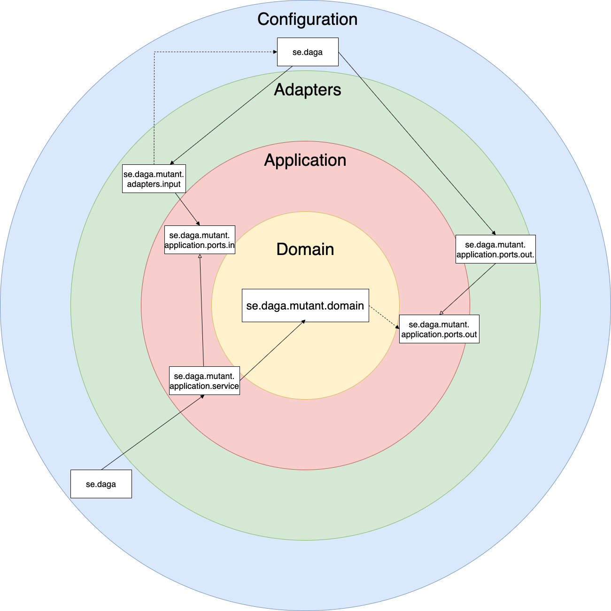

# Test Mercado libre -  Humanos Mutantes de Magneto   


A partir de las instrucciones otorgadas por el equipo de Mercado Libre para presentar el test de ingreso se procede a desarrollar una idea que satisfaga los requerimientos funcionales y no funcionales y a su vez, cumpla con la meta del ejercicio.

Para ayudar a Magneto con su plan se procede en primera instancia a encontrar un algoritmo  rápido que permita encontrar los patrones mutantes en el DNA de los humanos, luego de indagar se encontró que uno de los algortimos más efecientes para buscar elementos repetidos es el *Suffix tree*, el cual nos permite buscar patrones de ADN
o secuencias de proteínas. Luego se buscó la forma de implementar este *tree* en el lenguaje de programación empleado para el ejercicio (para más información visitar [Suffix tree Java implementation]( https://www.baeldung.com/java-pattern-matching-suffix-tree)).

Basado en lo anterior se decidió que la manera más efectiva de hallar los valores repetidos de ADN era implementando la búsqueda aleatoria de manera vertical, horizontal y oblicuo en la matriz genética, para esto se empleó un colector custom *API Stream* de Java 8 
 y un patrón *strategy* que contiene los comportamientos de cada una de las búsquedas seleccionadas.

Una vez el algoritmo fue completado, se abordó la solución de todo el proyecto desde una arquitectura hexagonal con el fin de lograr que la solución sea mantenible.
Se hizo uso del *framework spring boot* y de la base de datos MongoDB. 

Por último la solución se dejó habilitada para que pueda ser ejecutada desde un *Docker*.

A continuación se podrán apreciar el diagrama a nivel general de la paqueteria y la implementación de la arqutectura limpia en la solución.



### Proceso para iniciar la solución:
#### Prerequisitos:
- [Java](https://adoptopenjdk.net/)
- [Docker](https://www.docker.com/)
#### Proceso:
1. Ir al root del proyecto y lanzar el comando desde la terminal.
```bash
./gradlew clean build
 ```
2. Lanzar el comando para construir y ejecutar los contenedores con la solución.
```bash
docker-compose up
 ```
3. Lanzar el comando para revisar el status del servicio.
```bash
curl --location --request GET 'http://localhost:8080/actuator/health
```

4. Lanzar el comando para validar si el humando es mutante (la prueba se puede hacer tambien desde postman).
```bash
curl -v --location --request POST 'http://localhost:8080/mutant' \
--header 'Content-Type: application/json' \
--data-raw '{
"dna": ["ATGCGA",
        "CAGTGC",
        "TTATTT", 
        "AGACGG",
        "GCGTCA",
        "TCACTG"]
}'
 ```

5. Lanzar el comando para validar las estadisticas (la prueba se puede hacer tambien desde postman).
```bash
curl --location --request GET 'http://localhost:8080/stats'
 ```
**Nota**: La solución se puede ejecutar sin docker, para ello se debe lanzar el comando del primer punto del proceso y luego:
```bash
java -jar build/libs/meli-magneto-mutant-humans-1.0.0.jar
 ```
Tener encuenta que se debe tener instaldo MongoDB, se puede configurar las propiedades de la solución mediante las variables.
```bash
PORT_APPLICATION
PORT_MONGO_DB
HOST_MONGO_DB
 ```
